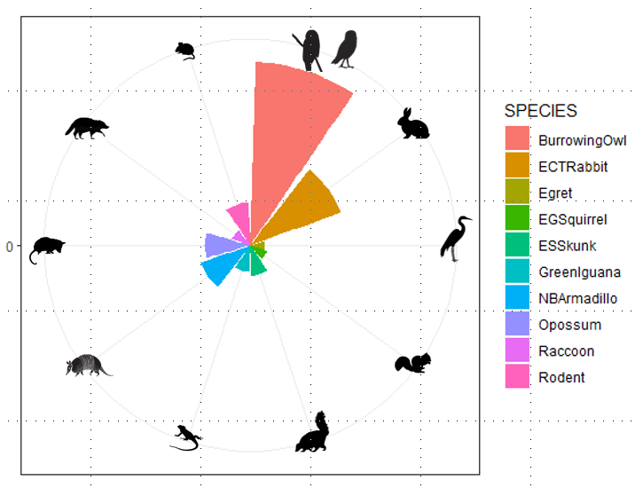

# Gopher Tortoise SCBD Rose Plot Exploration

An abundance-based visualization of Species Contribution to Beta Diversity (SCBD) from camera-trap observations at Gopher Tortoise burrows in southeast Florida. This is a companion exploration to the published analysis in [Huffman et al. 2025](https://github.com/Jessene/gopher-tortoise-camera-analysis), produced from the same underlying dataset but using a different methodological lens.

*Ten species with the largest contributions to beta diversity (SCBD) across four southeast Florida study locations. Rose plot produced in R with ggplot2 polar coordinates; species silhouettes added manually from public-domain sources.*

## What this shows

Each wedge represents one species' contribution to differences in community composition across the four study sites (FAU Grass, FAU Scrub, Jonathan Dickinson Scrub, Pine Jog Pine Flatwoods). Larger wedges = species whose abundance patterns drive more of the between-site ecological variation. Burrowing Owls and Eastern Cottontail Rabbits dominate, which tracks with what camera traps actually captured most at these burrows.

## Why this is separate from the published paper

The published analysis in Huffman et al. 2025 used **presence-absence data** for its beta diversity work. That was the right call for the paper's specific goals, because separating species turnover/replacement from nestedness/richness is harder when abundance is in the mix (see Baselga 2013, cited in the paper).

This repository uses **abundance data** with a Hellinger transformation, which lets you compute SCBD — a per-species metric that asks "which species contribute most to the beta diversity signal?" The abundance data itself comes from the same camera observations, but some caveats apply: camera-trap counts can double-count individuals revisiting a burrow, and the sampling wasn't designed for standardized abundance estimation. Those caveats are exactly why the paper chose presence-absence.

The rose plot is still informative as an **exploratory visualization** — it tells you which species are doing the heavy lifting in community differentiation — but the numerical SCBD values should not be treated as rigorous abundance-based inference.

## Files

| File | Description |
|---|---|
| `rose_plot_scbd.R` | Main analysis script — data preparation, per-site summation, Hellinger beta diversity, rose plot |
| `rose_plot_scbd.png` | Final figure with silhouettes |

## Data

This analysis was produced using camera-trap observation data collected by collaborators for the Huffman et al. 2025 study. The underlying dataset is not included in this repository and is not mine to distribute. The code here is shared as a record of the analysis and visualization workflow — it is not runnable as-is without the source data, which remains with the original collaborators.

For data inquiries related to the published study, please refer to [Huffman et al. 2025 in *Southeastern Naturalist*](https://www.eaglehill.us/SENAonline/).

## Methods at a glance

- Sum observations per species per site → wide-format matrix
- `adespatial::beta.div()` with `method = "hellinger"` → SCBD vector
- Select the 10 species with the largest SCBD values
- `ggplot2` with `coord_polar()` → rose plot
- Silhouettes added manually in post

## Tools

R, tidyverse, vegan, adespatial, ggplot2

## Related

- [gopher-tortoise-camera-analysis](https://github.com/Jessene/gopher-tortoise-camera-analysis) — the main repo containing the published analysis (Huffman et al. 2025, *Southeastern Naturalist*)

## License

MIT
